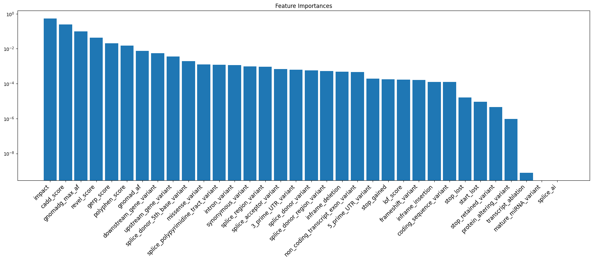
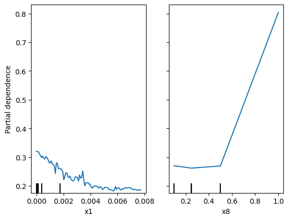
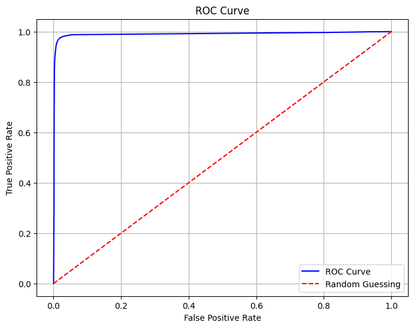
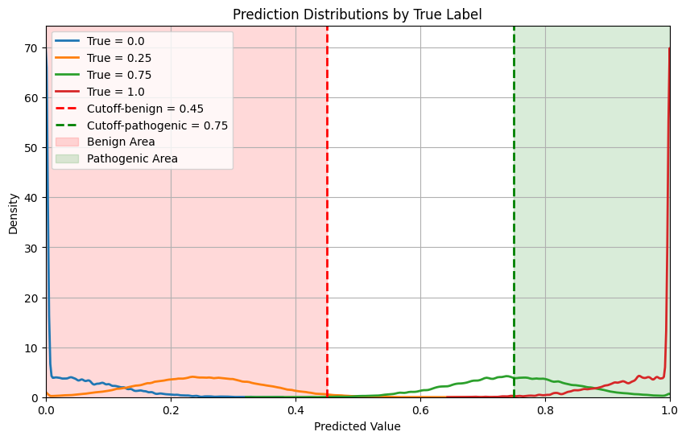

# Random Forest Regression Model

## 1. Description

The Random Forest model is trained on all variants from the ClinVar dataset.
Each variant includes 10 features:

- **Consequence**
- **Impact**
- **GnomAD Allele Frequency**
- **GnomAD Max Allele Frequency**
- **Splice\_AI**
- **Gerp++**
- **LOFTEE**
- **Polyphen-2**
- **Revel**
- **Cadd**

The ClinSig labels from the ClinVar dataset are used as ground truth. To get an insight on how the data was [collected](https://github.com/imgag/Teamprojekt_SS25_Gruppe1/blob/d743cde2062544487d7396df4c0bfd6f12bbf832/MachineLearning/Processing/ClinVar.ipynb) and [processed](https://github.com/imgag/Teamprojekt_SS25_Gruppe1/blob/d743cde2062544487d7396df4c0bfd6f12bbf832/MachineLearning/Processing/Processing.ipynb) take a look into the linked files, those Jupiternotebooks are readily reusable with alternative VCF files that include label.
As the model is trained on other ML-model scores, it is a Meta-Model, returning a value between **0.0** and **1.0**. The model was build with the RandomForestRegressor package from [scikit-learn](https://scikit-learn.org/stable/modules/generated/sklearn.ensemble.RandomForestRegressor.html). The model uses the default settings with 100 trees in the forest.

---

## 2. Score Interpretation and Cut-off

Values above **0.75** indicate a **pathogenic** variant, and values below **0.45** indicate a **benign** variant.  
The cut-off was computed using the following formulas, taking into account both false-negative and false-positive values:

$$
p_\mathrm{pathogenic} = \frac{ \sum \text{All samples below } X + \sum \text{All benign samples above } X }{ \text{Total number of samples} }
$$

$$
p_\mathrm{benign} = \frac{ \sum \text{All samples above } X + \sum \text{All pathogenic samples below } X }{ \text{Total number of samples} }
$$

---

The exact calculatet values can be found [here](https://github.com/imgag/Teamprojekt_SS25_Gruppe1/blob/d743cde2062544487d7396df4c0bfd6f12bbf832/MachineLearning/Processing/Processing.ipynb) in cell 39.

## 3. Features

**Feature Importance:**  

This plot demonstrates that the most influential features are Impact, CADD Score, and GnomAD_AF. Additionally, the importance of the remaining features declines considerably in comparison.

**Feature Impact:**  
GnomAD_AF left, Impact right:

The plot shows that a higher frequency results in a lower score indicating bening variants. A higher Impact score High/Modifier results into a higher prediction indicating a pathogenic variant.

---

## 4. Quality Assessment

The model was tested for overfitting using 10-fold cross-validation, resulting in a score of **0.8177**.  
The following quality metrics were derived:

- **R² score:** 0.817
- **Mean Squared Error:** 0.007
- **Root Mean Squared Error:** 0.084
- **Mean Absolute Error:** 0.032

The ROC curve below shows the model's sensitivity and specificity:

The test was conducted on unseen data with a sample size of **232,287**.  
Below is a graph showing the predicted value distribution for each class

Blue is the distribution for benign,Orange is the distribution for  likely benign, Green is the distribution for  likely pathogenic, Red is the distribution for  pathogenic.  
The cut-off are marked with a dashed line, red is the cut-off for benign, green is the cut-off for pathogenic.

## Download link for the trained ML-Model:
[Download](https://1drv.ms/f/c/b2a72d124c1469eb/EvG4ll8GhIpEphhorV2LVF4BfuZSFrG09no7kLfgY5a-UA?e=JCy1AI)

