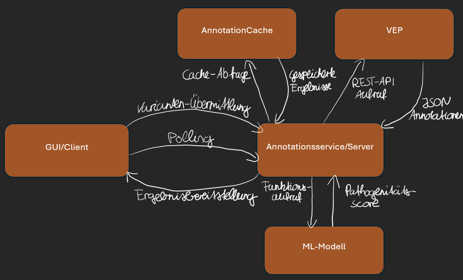
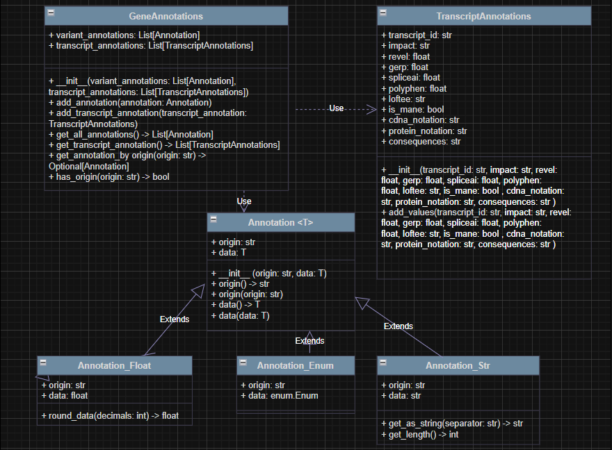

# NGS Variant Analysis System Manual

## What is the Project?

This project provides a comprehensive solution for **"Identification and annotation of pathogenic genomic mutations detected by Next Generation Sequencing"**. It combines multiple components to create a complete workflow from raw sequencing data to clinical variant interpretation.

## Project Overview

The system consists of three main components that work together to analyze genomic variants:

### Decision Support System (GUI)

### Key GUI Features

#### Auto-Filtering

**Quality Filters:** Automatically apply common quality thresholds
**Frequency Filters:** Filter by population allele frequency (≥1%)
**Impact Filters:** Exclude low-impact variants (MODIFIER)

#### HPO Integration

**Local HPO Processing:** No internet required for HPO matching
**Gene-Disease Associations:** Link variants to known disease genes
**Phenotype Scoring:** Score variants based on phenotype relevance

#### Filtering

**Value Lists:** See available values for each column
**Filter Validation:** Automatic validation of numeric ranges

#### Export Capabilities

**JSON Export:** Export filtered variants with all annotations
**Column Selection:** Choose which data to include in exports
**Filter Preservation:** Export includes current filter settings

### Annotation Service (Backend)
**Purpose**: High-performance variant annotation and data enrichment system
- **Intelligent Caching**: Store and retrieve previously annotated variants (~5ms response time)
- **Batch Processing**: Efficiently handle multiple variants through optimized batching
- **External Integration**: Connect to Ensembl VEP REST API for comprehensive annotations
- **ML Integration**: Apply AI-based pathogenicity scoring using Random Forest model
- **REST API**: Provide standardized endpoints for variant submission and retrieval

## Installation Instructions

### System Requirements
- **Operating System**: Linux, macOS, or Windows (with WSL)
- **Python**: Version 3.8 or higher
- **PyQt5**: Version 5.15.11 or higher

### Project Installation

#### 1. Clone Repository
```bash
git clone [repository-url]
cd Teamprojekt_SS25_Gruppe1
```

#### 2. Install Docker

**For Ubuntu/Debian:**
```bash
# Update package index
sudo apt update

# Install Docker
sudo apt install docker.io

# Install Docker Compose (choose one method)
# Method 1: Using apt (Ubuntu 20.04+)
sudo apt install docker-compose-plugin

# Method 2: Direct download (if plugin not available)
sudo curl -L "https://github.com/docker/compose/releases/latest/download/docker-compose-$(uname -s)-$(uname -m)" -o /usr/local/bin/docker-compose
sudo chmod +x /usr/local/bin/docker-compose

# Add your user to docker group (optional, avoids using sudo)
sudo usermod -aG docker $USER
# Log out and back in for group changes to take effect
```

**For macOS:**
```bash
# Install Docker Desktop from https://docs.docker.com/desktop/mac/install/
# Docker Compose is included with Docker Desktop
```

**For Windows (WSL):**
```bash
# Install Docker Desktop for Windows with WSL2 backend
# Follow: https://docs.docker.com/desktop/windows/install/
```

#### 3. Download ML Model
```bash
# Place Random_forest_model.pkl in MachineLearning/RandomForest/ directory
# model should be available for download via https://1drv.ms/f/c/b2a72d124c1469eb/EvG4ll8GhIpEphhorV2LVF4BfuZSFrG09no7kLfgY5a-UA?e=JCy1AI
```

#### 4. Install GUI dependencies
```bash
# Not distributed via Docker PyQt5 needs to be installed manually
pip install PyQt5==5.15.11 
            PyQt5-sip==12.17.0 
            PyQt5-Qt5==5.15.17
```

### Starting the Service

#### 1. Start the services
```bash
# For Docker Compose V2 (recommended)
docker compose up -d

# For older Docker Compose V1 (if above fails)
docker-compose up -d
```

#### 2. Check service status
```bash
# For Docker Compose V2
docker compose ps

# For Docker Compose V1
docker-compose ps
```

#### 3. Test the API
```bash
curl http://localhost:5000/health
curl http://localhost:5000/statistics
```

#### 4. Start GUI Application
```bash
# Navigate to project root
cd Teamprojekt_SS25_Gruppe1
python GUI/App_window.py
python GUI/download_hpo_files.py # <-- Run this only once to download the HPO Library files
```
**HPO Library inclusion**
1. Once GUI is open Click the load HPO Files.
2. Navigate to the location where the download_hpo_files.py saved the necessary HPO Files (usually GUI/...)
3. Select the hpo.obo -> open
4. Next select the Phenotypes_to_genes.txt -> open
5. Confirmation should pop up
6. (**only if needed**) If an annotation was run already, navigate to the HPO filters tab and click the button `Match HPO Terms to Genes` for matching of the terms after annotation (should match if HPO library is installed before annotation)

**GUI Features:**
After starting the GUI application, users can:
- **Upload VCF Files**: Load variant data from standard VCF format files
- **Annotate Variants**: Click annotation button to process uploaded variants through the annotation service
- **Export Results**: Export annotated data as JSON format for further analysis
- **Apply Filters**: Choose from various filtering options to prioritize variants
- **Preconfigured Filters**: Access predefined filter sets for common analysis scenarios
- **HPO Term Search**: Search for Human Phenotype Ontology terms to match variants with clinical phenotypes

#### 5. Stop the services
```bash
# For Docker Compose V2
docker compose down

# For Docker Compose V1
docker-compose down
```

### Connect to MariaDB
```bash
# For Docker Compose V2
docker compose exec mariadb mysql -u annotation_user -psecure_pass_2024 AnnotationCache

# For Docker Compose V1  
docker-compose exec mariadb mysql -u annotation_user -psecure_pass_2024 AnnotationCache

# Note: If connection fails, MariaDB might be running on port 3307
# Check the docker-compose.yml file for the correct configuration
```

### Testing the Installation

**Prerequisites Check:**
```bash
# Verify Docker is installed and running
docker --version
docker compose version  # or docker-compose --version

# Ensure docker-compose.yml exists in project root
ls -la docker-compose.yml
```

#### 1. Submit Test Variant
```bash
curl -X POST http://localhost:5000/submit \
  -H "Content-Type: application/json" \
  -d '{"chrom": "chr1", "pos": 12345, "ref": "A", "alt": "G"}'
```

#### 2. Check Processing Status
```bash
curl http://localhost:5000/poll/chr1:12345:A>G
```

#### 3. View Statistics
```bash
curl http://localhost:5000/statistics
```

## System Architecture

### Overall Architecture

The three components form an integrated client-server architecture:

- **Client**: Decision Support GUI communicates via REST API
- **Server**: Annotation Service processes requests and manages data
- **External Services**: Ensembl VEP API provides biological annotations
- **Storage**: MariaDB database serves as annotation cache and permanent storage



### Core Components

#### 1. REST API Server (Flask)
- **Purpose**: Provides HTTP endpoints for variant submission and status polling
- **Key Endpoints**:
  - `POST /submit` - Submit individual variants for annotation
  - `GET /poll/{variant_id}` - Check annotation status and retrieve results
  - `GET /health` - Service health monitoring
  - `GET /statistics` - Processing statistics and metrics

#### 2. Batch Processor
The heart of the annotation service, implementing intelligent batching and parallel processing:

**Key Features:**
- **Automatic Batching**: Collects variants into batches of up to 200 variants
- **Time-Based Triggers**: Processes batches after 5 seconds to balance latency and efficiency
- **Parallel Processing**: Uses thread pools with configurable worker counts (default: 3 workers)
- **Retry Management**: Tracks retry attempts and communicates availability to clients (default: 3 attempts maximum)

**Processing Flow:**
1. **Variant Collection**: Incoming variants are queued in memory
2. **Batch Triggering**: Batches are processed when reaching 200 variants OR after 5-second timeout
3. **VEP API Communication**: Sends HTTP requests to Ensembl VEP REST API
4. **Result Processing**: Parses VEP responses and extracts relevant annotations
5. **Database Storage**: Stores processed annotations using bulk operations

#### 3. Database Layer (MariaDB)
- **Annotation Table**: Stores main variant information (gene, CADD scores, frequencies, etc.)
- **Transcript Table**: Stores transcript-specific consequences and predictions
- **Caching Strategy**: Previously annotated variants are served from cache (~5ms response time)

#### 4. ML Integration
- **Random Forest Model**: Provides pathogenicity predictions (0-1 score)
- **Feature Extraction**: Extracts 9 key features from VEP JSON (Consequence, Impact, GnomAD frequencies, SpliceAI, GERP++, LOFTEE, PolyPhen-2, REVEL, CADD)
- **Fallback Mechanism**: Uses default scoring when ML model unavailable
- **Detailed ML documentation**: [MachineLearning/README.md](MachineLearning/README.md)

## Data Models

This section describes how annotation data for each variant is represented and structured within the system.

### Annotation Class Hierarchy



The system uses a generic, type-safe approach to handle different annotation data types:

- **`Annotation<T>`**: Generic base class that stores annotation data with its origin source
- **`Annotation_Float`**: Handles numeric annotations (CADD scores, frequencies, ML scores)  
- **`Annotation_Str`**: Manages string-based annotations (gene symbols, consequences)
- **`Annotation_Enum`**: Processes enumerated values (impact levels, classifications)
- **`GeneAnnotations`**: Collection manager for all variant-level annotations
- **`TranscriptAnnotations`**: Standalone class managing transcript-specific data (REVEL, GERP++, SpliceAI, PolyPhen, LOFTEE, MANE status, HGVS notations)

### Data Flow: Classes to Database

The class-based annotations are ultimately stored in two MariaDB tables:

**Annotation Table** (Variant-level data):
- `variant_id`, `gene`, `CADD`, `ML_score`, `most_severe_consequence`  
`allele_freq`, `max_allele_freq`, `OMIM`, `CLINSIG`

**Transcript Table** (Transcript-specific data):
- `variant_id`, `transcript_id`, `polyphen`, `protein_notation`, `REVEL`
`Splice_AI`, `Mane`, `LOFTEE`, `impact`, `GERP`, `cDNA_notation`, `consequences`

This dual approach ensures type safety during processing while providing optimized storage for retrieval.

## Annotation Data Sources

### External APIs
- **Ensembl VEP REST API**: Primary source for variant effect predictions
- **Rate Limiting**: Respects API limits through batching strategy

### Annotation Categories

#### Variant-Level Annotations
- **Gene Information**: Gene symbol and identifiers
- **Consequence Prediction**: Most severe consequence type
- **Pathogenicity Scores**: CADD, ML-derived pathogenicity scores
- **Population Frequencies**: gnomAD allele frequencies, maximum population frequencies
- **Clinical Data**: ClinVar classifications, OMIM disease associations

#### Transcript-Level Annotations
- **Impact Assessment**: HIGH/MODERATE/LOW/MODIFIER impact classifications
- **Protein Predictions**: PolyPhen scores, REVEL scores
- **Splicing Predictions**: SpliceAI delta scores
- **Conservation Scores**: GERP++ evolutionary conservation
- **HGVS Nomenclature**: Standardized cDNA and protein change descriptions
- **Transcript Flags**: MANE transcript identification
- **Loss-of-Function**: LOFTEE predictions for protein-truncating variants

## API Usage Patterns

### Typical Workflow
1. **Variant Submission**: Client submits variant via `POST /submit`
2. **Status Polling**: Client polls `GET /poll/{variant_id}` for completion
3. **Result Retrieval**: Annotation data returned when processing complete
4. **Error Handling**: Client must handle retry logic when API indicates retry is available

### Response States
- **`processing`**: Variant is currently being annotated
- **`completed`**: Annotation successful, data available
- **`failed`**: Annotation failed after maximum retry attempts, no further retries possible
- **`retry_available`**: Processing failed but client can resubmit the variant for another attempt
- **`not_found`**: Variant not submitted or unknown

## Performance Characteristics

### Throughput
- **Batch Processing**: Up to 200 variants per VEP API call
- **Parallel Workers**: 3-8 concurrent processing threads
- **Database Operations**: Bulk insert operations for optimal performance

### Response Times
- **Cache Hits**: ~5ms (variants already annotated)
- **Fresh Annotations**: 5-30 seconds depending on batch size and VEP API response times
- **Large Batches**: Processing time scales sub-linearly due to batching efficiency

## Configuration Options

### Batch Processing Settings
Edit `core/batch_processor.py`:
```python
max_wait_time = 5.0        # Seconds before processing batch
max_workers = 3            # Parallel processing threads
max_retries = 3            # Internal retry attempts for VEP API failures
```

## Integration Points

### Input Requirements
- **VCF Format Support**: Standard VCF file format compatibility
- **Variant Specification**: Chromosome, position, reference allele, alternative allele
- **Optional Parameters**: Genotype quality scores, priority flags

### Output Format
- **JSON Structure**: Standardized annotation objects with nested transcript data
- **Database Schema**: Relational storage with optimized indexing for fast retrieval
- **API Response**: RESTful JSON responses with comprehensive error handling

## Quality Assurance

### Data Validation
- **Input Validation**: Chromosome/position format checking
- **Error Tracking**: Comprehensive logging of processing errors and retries

### Testing & Validation

The system includes a comprehensive test suite to ensure data integrity and API reliability.

#### Available Tests

**Database Validation** (`test_parser.py`)
- Creates reference annotations from VEP data using BatchProcessor logic
- Cross-validates database entries against reference data
- Generates detailed validation reports with field-level precision

**API Integration** (`testing_small.py`)
- Tests core service functionality and endpoint responsiveness
- Validates variant submission, polling, and result retrieval workflow
- Verifies statistics and monitoring endpoints

**Scale Testing** (`testing_large.py`)
- Processes real VCF datasets (number of variants can be specified)
- Tests batch processing performance and resource management
- Includes debugging for variant ID mapping and submission tracking


## Features & Usage (GUI)
### Main Interface Overview
**The GUI provides a comprehensive variant analysis workbench with:**
#### 1. Table View (Left Panel - 60%)

- **VCF Data Display:** Shows loaded variants with all standard VCF columns 
- **Annotation Columns:** Displays API-retrieved annotations (Gene, CADD, REVEL, etc.) 
- **HPO Integration:** Shows phenotype terms associated with genes 
- **Dynamic Columns:** Automatically detects and displays FORMAT fields 
- **Sortable & Searchable:** Full sorting and search capabilities 

### 2. Filter Tabs (Right Panel - 40%)
##### Standard Filtering Tab

- Filter by basic VCF columns (CHROM, POS, REF, ALT, QUAL, FILTER) 
- Numeric range filtering for quality scores 
- Text pattern matching for identifiers 
- Filter by annotation scores (CADD > 15, REVEL > 0.5, etc.) 
- Consequence type filtering (missense, nonsense, splice site) 
- Allele frequency filtering (gnomAD AF, population-specific) 
- Clinical significance filtering (ClinVar classifications) 
- Dynamic filtering based on VCF FORMAT fields  
- Genotype quality (GQ) filtering 
- Read depth (DP) filtering 
- Allele frequency ratio filtering 

##### HPO Filters Tab

- **HPO File Loading:** Load local HPO ontology files
- **Phenotype Search:** Search HPO terms by description
- **Gene-Phenotype Filtering:** Filter variants by associated phenotypes
- **Disease Association:** Link variants to disease phenotypes

Format Filters Tab


##### Header Inspector Box

- **VCF Header Analysis:** Inspect INFO, FILTER, FORMAT definitions
- **Metadata Viewing:** View VCF file metadata and annotations
- **Field Documentation:** Understand field meanings and formats

#### 3. Active Filters Display (Bottom Right)

- **Real-time Filter Status:** Shows all active filters with descriptions
- **Filter Management:** Remove individual filters or reset all
- **Auto-Filter Toggle:** Enable/disable automatic quality filtering
- **Column Visibility:** Show/hide specific columns

### GUI Usage Workflow

#### 1. Loading Data
```
1. Click "Load VCF File" → Select your VCF/VCF.gz file
2. Data appears in table with standard VCF columns
3. Use "Choose columns" to customize visible columns 
```
#### 2. Annotation Workflow
```
1. Load VCF file with variants
2. Click "Annotate via API" → Submits variants to annotation service
3. Progress shown in status bar
4. Annotations populate automatically in table
5. Use annotation filters to focus on variants of interest
```
#### 3. HPO Analysis Workflow
```
1. Click "Load HPO Files" → Select hp.obo and phenotype_to_genes.txt
2. Go to HPO Filters tab
3. Search for phenotype terms (e.g., "intellectual disability")
4. Add HPO filters to show only variants in relevant genes
5. Click "Match HPO Terms to Genes" to populate HPO columns
```
#### 4. Filtering & Analysis
```
1. Use tabs to set up filters by category
2. Combine multiple filters (AND logic)
3. View filtered results in real-time
4. Export filtered data using "Save JSON File"
```


